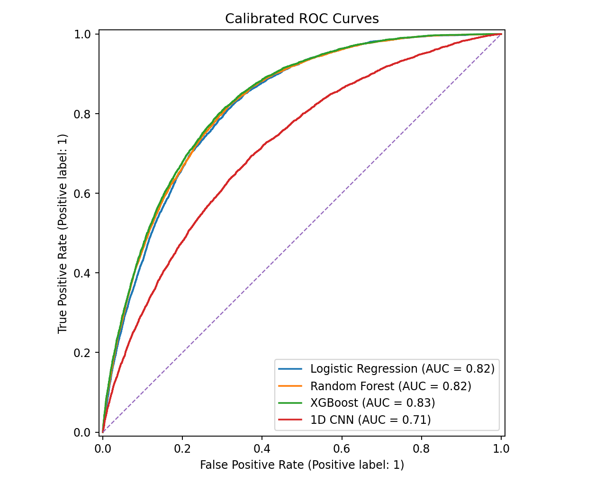
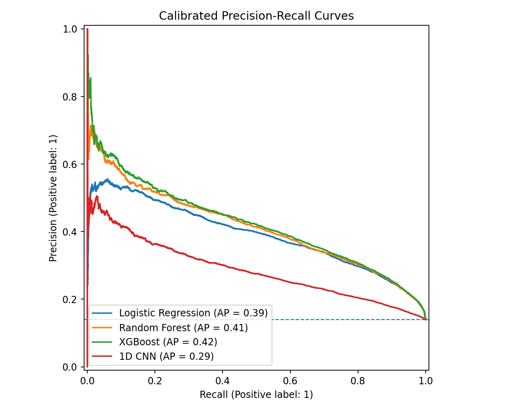
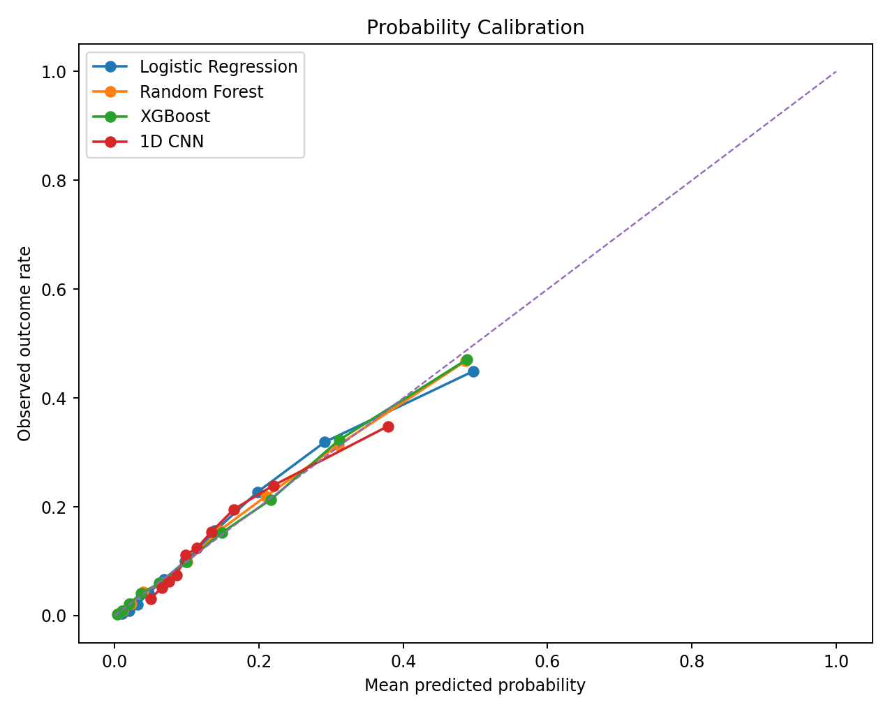
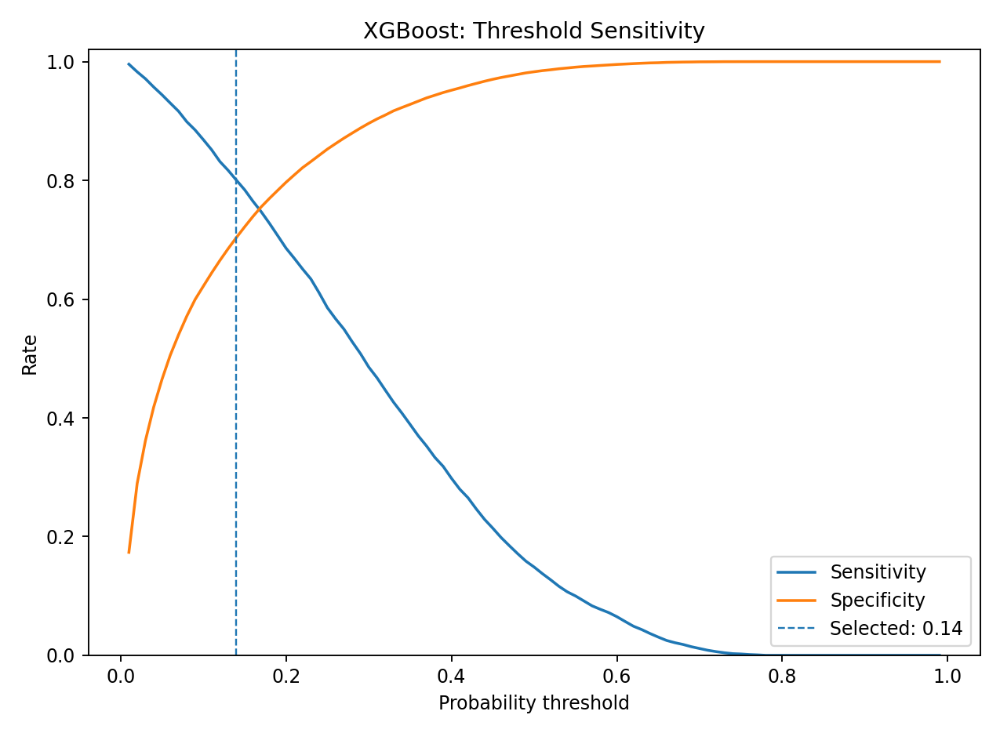
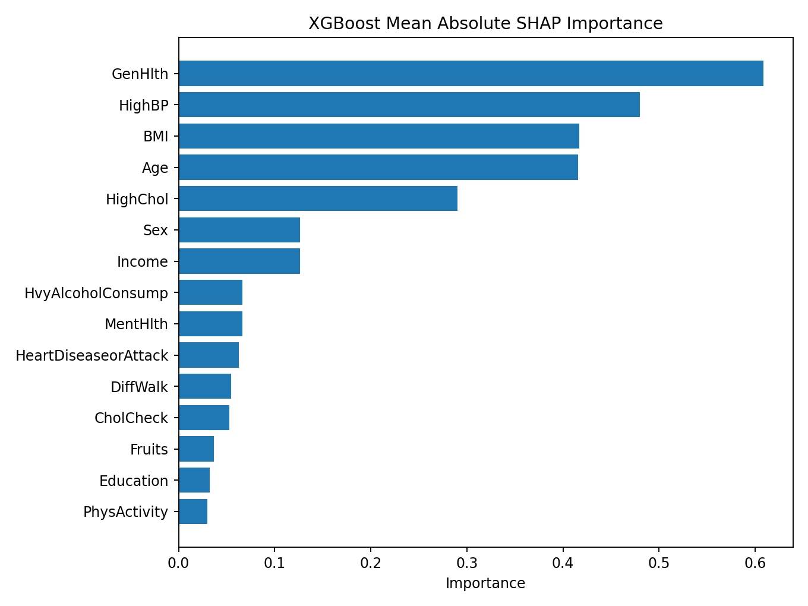
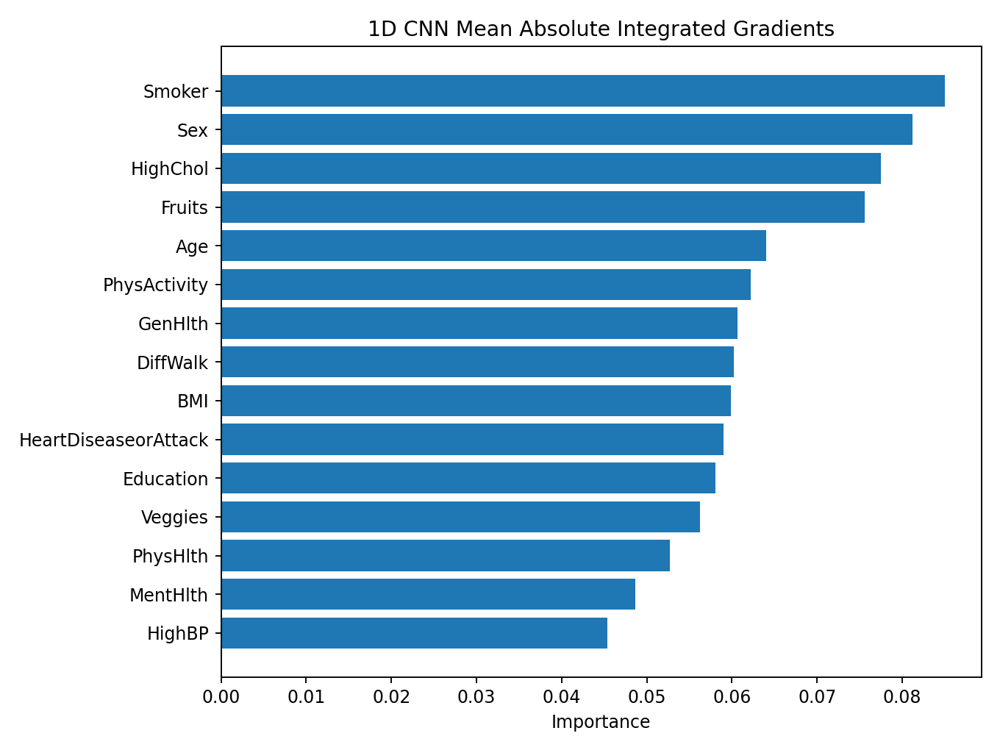
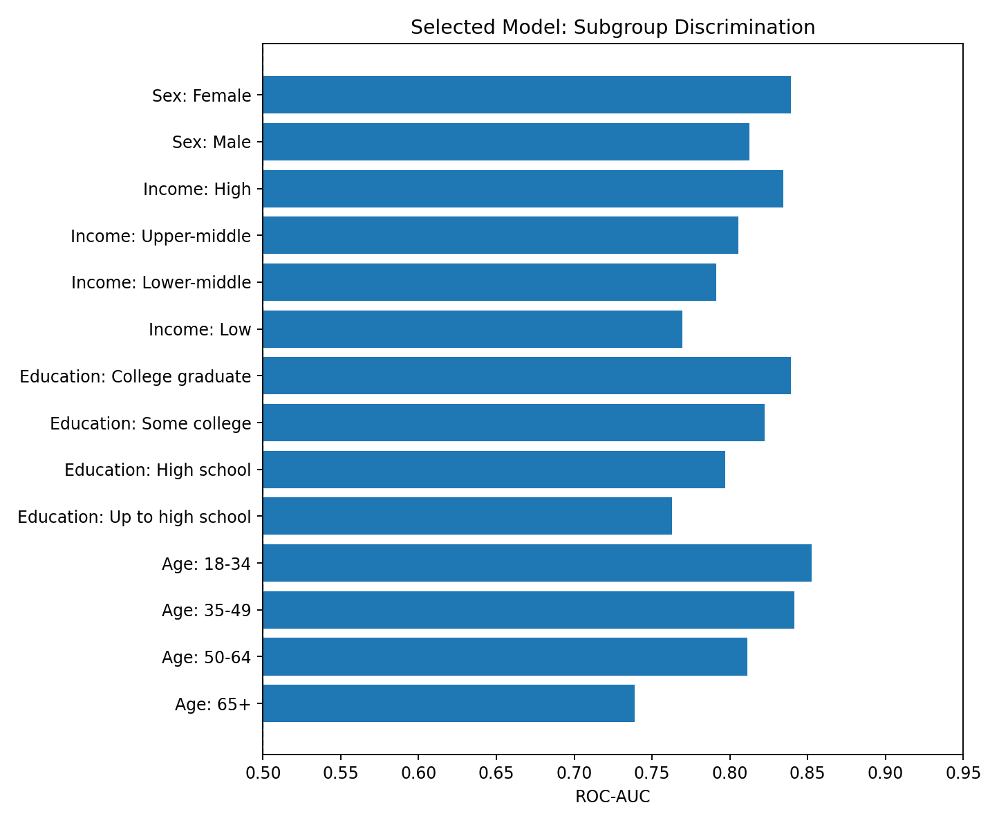

# Diabetes Risk Prediction with Machine Learning and Deep Learning

A reproducible healthcare machine-learning project comparing **Logistic Regression**, **Random Forest**, **XGBoost**, and an experimental **one-dimensional convolutional neural network (1D CNN)** for diabetes risk prediction.

The project emphasises model reliability rather than accuracy alone: probability calibration, sensitivity-oriented threshold selection, bootstrap uncertainty intervals, subgroup evaluation, SHAP explanations, and CNN Integrated Gradients.

> This is a portfolio research project. It is not a clinical diagnostic device and must not be used for treatment, eligibility, insurance, or individual medical decisions.

## Research Question

How accurately and reliably can demographic, behavioural, and self-reported health indicators identify individuals with elevated diabetes or prediabetes risk, while maintaining approximately 80% sensitivity?

## Dataset

The project uses the **CDC Diabetes Health Indicators** dataset distributed through the UCI Machine Learning Repository.

- 253,680 survey records
- 21 predictor variables
- Binary outcome: no diabetes versus prediabetes/diabetes
- Outcome prevalence: 13.93%
- No missing values in the released analytical dataset
- Sensitive attributes include sex, income, and education

Dataset citation:

> CDC Diabetes Health Indicators [Dataset]. (2017). UCI Machine Learning Repository. https://doi.org/10.24432/C53919

The full dataset is not committed to this repository. Run `python data/download_data.py` to retrieve it through `ucimlrepo`. A 1,500-row stratified sample is included only for lightweight inspection.

## Evaluation Design

The full dataset is divided into mutually exclusive stratified subsets:

| Split | Purpose | Share |
|---|---|---:|
| Training | Fit model parameters | 60% |
| Validation | XGBoost early stopping and CNN early stopping | 10% |
| Calibration | Platt calibration and threshold selection | 15% |
| Test | Final locked evaluation | 15% |

The CNN is trained on a fixed, stratified 40,000-record subset of the training partition and validated on 10,000 records. This keeps the deep-learning workflow reproducible on CPU hardware while preserving the full calibration and test sets.

## Test-Set Results

The locked test set contains 38,052 records. Each model is Platt-calibrated, and its decision threshold is selected on the calibration set to target approximately 80% sensitivity.

| Model | ROC-AUC | PR-AUC | Brier Score | Threshold | Sensitivity | Specificity | Precision |
|---|---:|---:|---:|---:|---:|---:|---:|
| **XGBoost** | **0.828** | **0.423** | **0.097** | 0.14 | 0.803 | 0.705 | 0.306 |
| Random Forest | 0.824 | 0.414 | 0.098 | 0.13 | 0.813 | 0.690 | 0.298 |
| Logistic Regression | 0.820 | 0.391 | 0.100 | 0.12 | 0.817 | 0.678 | 0.291 |
| 1D CNN | 0.715 | 0.286 | 0.111 | 0.10 | 0.790 | 0.507 | 0.206 |

The XGBoost PR-AUC bootstrap interval was approximately **0.411 to 0.436** across 40 bootstrap samples. Full metrics and intervals are stored in `results/`.

## Interpretation

- XGBoost produced the strongest discrimination and probability accuracy.
- Random Forest performed similarly but generated more false-positive alerts at its selected threshold.
- Logistic Regression remained a credible, interpretable baseline.
- The 1D CNN did not outperform tree-based models. This is methodologically plausible because the tabular features do not possess the natural local structure found in images, audio, or time series.
- The CNN remains useful as a complete deep-learning benchmark demonstrating PyTorch model definition, weighted loss, mini-batch optimisation, early stopping, calibration, and Integrated Gradients.

## Model Reliability

### Discrimination





### Probability Calibration



### Threshold Analysis



### Explainability





### Subgroup Evaluation



Subgroup results are descriptive diagnostics, not proof of fairness. Differences may reflect prevalence, sample composition, measurement quality, feature availability, or model performance. See `documentation/responsible_use.md`.

## Repository Structure

```text
healthcare-ai-prediction/
├── data/
│   ├── download_data.py
│   ├── README.md
│   ├── raw/
│   └── sample/
├── documentation/
│   ├── data_dictionary.md
│   ├── methodology.md
│   ├── model_card.md
│   └── responsible_use.md
├── images/
├── models/
├── notebooks/
│   └── diabetes_risk_analysis.ipynb
├── results/
├── scripts/
│   ├── predict.py
│   ├── run_pipeline.py
│   ├── train_models.py
│   └── validate_data.py
├── src/
├── tests/
├── README.md
└── requirements.txt
```

## Installation

```bash
python -m venv .venv
```

Windows:

```bash
.venv\Scripts\activate
```

macOS or Linux:

```bash
source .venv/bin/activate
```

Install dependencies:

```bash
pip install -r requirements.txt
```

## Reproduce the Analysis

Download the data:

```bash
python data/download_data.py
```

Validate and run the complete pipeline:

```bash
python scripts/run_pipeline.py
```

Run the tests:

```bash
python -m pytest -q
```

## Generate Predictions

```bash
python scripts/predict.py \
  --input data/sample/diabetes_sample.csv \
  --output results/sample_scored.csv \
  --model xgboost
```

The output contains calibrated risk probabilities and threshold-based research classifications.

## Technical Methods

- Python, pandas, NumPy
- scikit-learn
- XGBoost
- PyTorch Conv1D
- Weighted binary cross-entropy
- Platt probability calibration
- ROC-AUC and PR-AUC
- Brier score and expected calibration error
- Sensitivity-oriented threshold selection
- Bootstrap confidence intervals
- SHAP for XGBoost
- Integrated Gradients for the CNN
- Demographic and socioeconomic subgroup diagnostics

## Limitations

- The outcome combines prediabetes and diabetes into one class.
- The inputs are survey-derived and include self-reported measures.
- The data are cross-sectional and do not establish causality.
- Some variables are socially sensitive and may encode structural inequities.
- The CNN treats the fixed feature ordering as a one-dimensional sequence even though the variables have no inherent spatial adjacency.
- Performance has not been externally validated on a contemporary clinical population.
- Thresholds are illustrative and do not represent a clinical operating policy.

## Portfolio Summary

Built and evaluated statistical, ensemble, gradient-boosting, and convolutional neural-network models for diabetes risk prediction. Implemented leakage-controlled data splitting, probability calibration, sensitivity-based threshold selection, bootstrap uncertainty assessment, SHAP and Integrated Gradients explanations, and subgroup reliability diagnostics.
